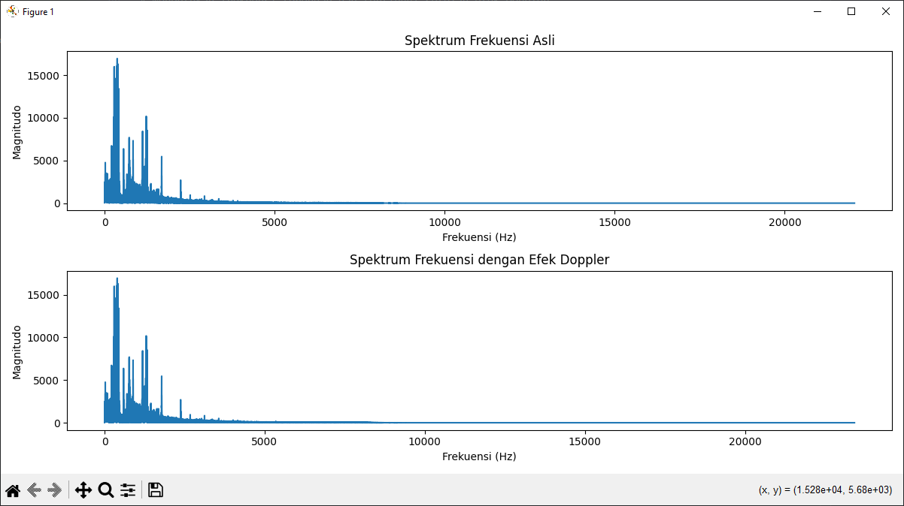
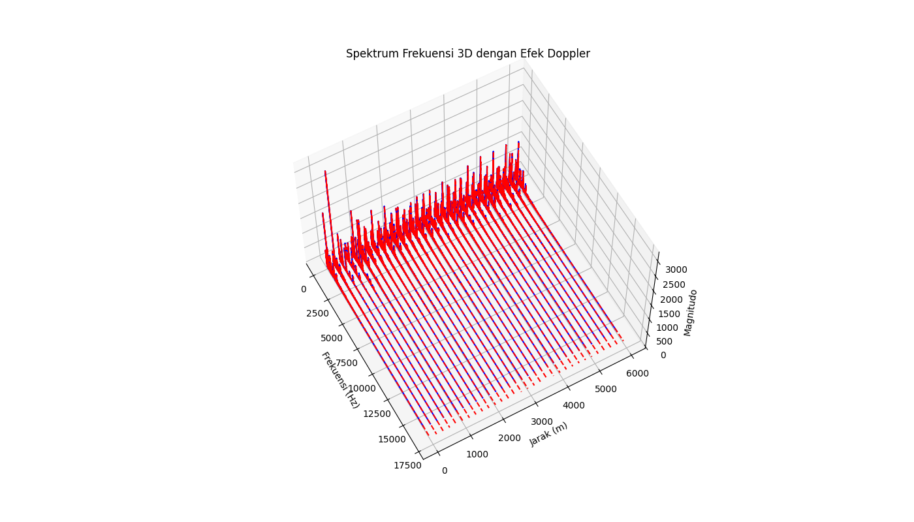

# Pola Suara Di Pengaruhi Efek Doppler

menentukan terendah dan tertinggi pada pola suara, baik normal maupun yang dipengaruhi efek doppler untuk selanjutnya dihitung FFT nya

<p align="center"></img></p>
<p align="center"></img></p>

## Cloning

```bash
git clone https://github.com/SukunDev/perhitungan-doppler-dan-fft.git
cd perhitungan-doppler-dan-fft
```

## Buat virtual environment

```bash
python -m venv .venv
```

Masuk ke virtual environment

### Powershell

```bash
.venv/Scripts/activate.ps1
```

### CMD

```bash
cd .venv/Scripts
activate
cd ../..
```

### Git Bash

```bash
source .venv/Scripts/activate
```

## Install depedency

```bash
pip install -r requirements.txt
```

## Menjalankan Program

```bash
usage: main.py [options] audio_sample operasi -o hasil_analisi_audio
example: python main.py 'sample/Data sample 1.wav' spectrum -o hasil_analisi_audio
         python main.py 'sample/Data sample 1.wav' 3d_spectrum

Perhitungan fft dan doppler effect

positional arguments:
  audio_sample          audio sample yang ingin di perhitungkan
  operasi               operasi yang di butuhkan list: spectrum, 3d_spectrum

options:
  -h, --help            show this help message and exit
  -o [OUTPUT], --output [OUTPUT]
                        save to excel
```
